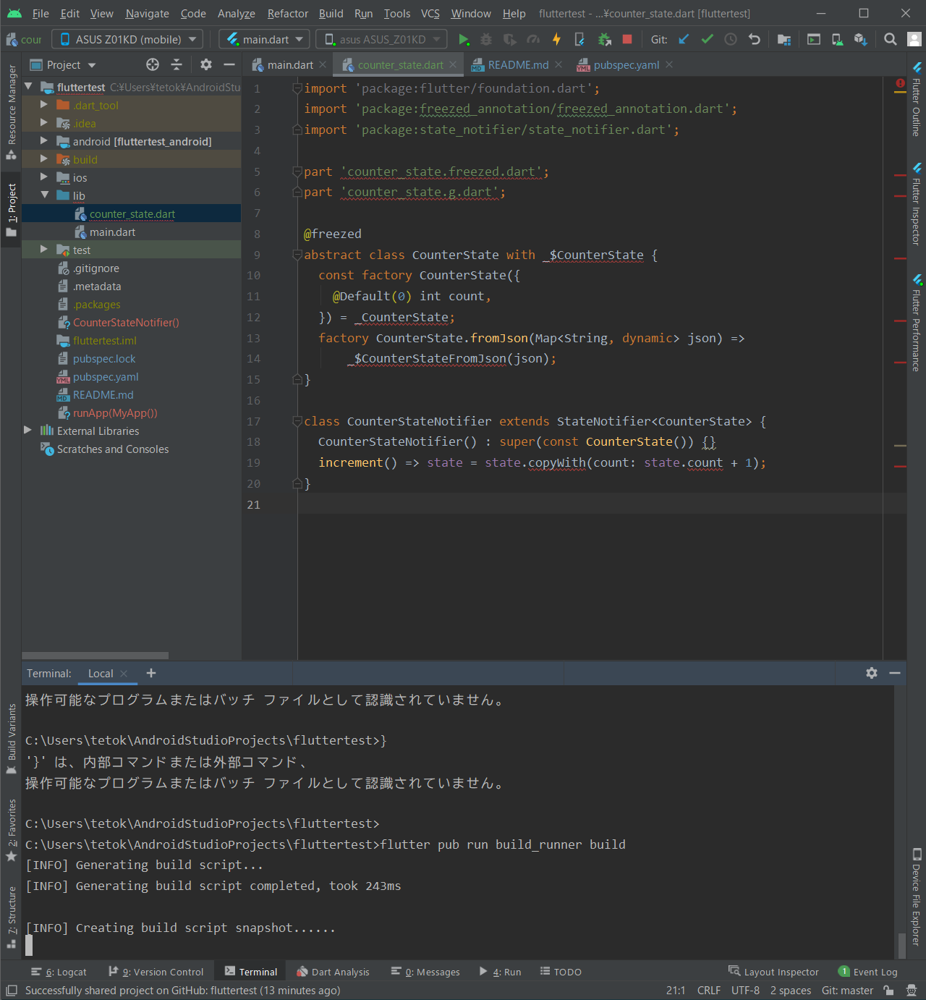
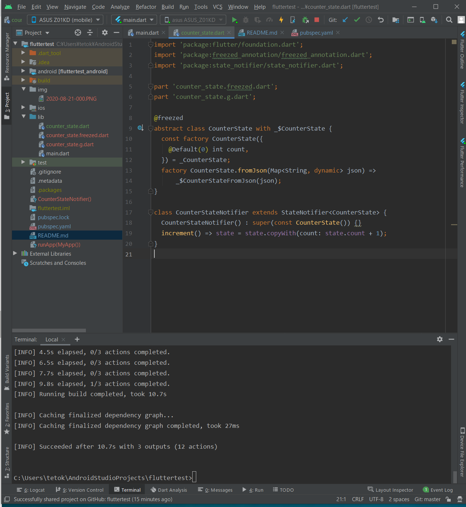

# fluttertest

試したいこと実行するためのテスト用

## テスト①
* 以下をテスト
    * [state_notifier と freezed を使って、Flutterのカウンターアプリをつくるよ - Qiita](https://qiita.com/karamage/items/4b1aff984b1af7541b73#%E3%81%8A%E3%82%8F%E3%82%8A%E3%81%AB)

* 以下参考
    * [Flutterとstate_notifierとfreezedで作るTodoアプリ - Qiita](https://qiita.com/seiichi3141/items/49f1db76f647335591c6)
    * [FlutterのStateNotifierパターンでカウントアップアプリ作ってみた - Qiita](https://qiita.com/RyoShimizu/items/a625bb96f93b759f67b8)
    * [Flutter freezedパッケージいい感じかも - Qiita](https://qiita.com/_masaokb/items/19a93be6079a80ac2d85)
    * [state_notifier | Dart Package](https://pub.dev/packages/state_notifier)
    * [freezed | Dart Package](https://pub.dev/packages/freezed)

* 重要部分抜粋
freezedパッケージは、イミュータブルなデータモデルを作成するのに使います。 
state_notifierでは、State(状態)をイミュータブルなデータモデルとして扱います。 
state_notifierとfreezedは相性が良く、セットで使うのが推奨されます。 
freezedを使うと、StateにcopyWith(clone)メソッドが自動的に生えるので、便利です。
freezedはコードを自動生成します。その際、build_runnerを使用します。

freezed 自動生成ファイル
freezed の自動生成ファイルを更新する際は、 ターミナルで以下のコマンドを叩いてビルドしてください。

`flutter pub pub run build_runner build`

「state_notifier」を使用することにより、簡単にWidgetから「状態」と「ロジック」を分離することができました。
「freezed」を使用することにより、Stateをデータを保持するだけのクラス、 変更不可(イミュータブル/freezed)なクラスにすることができました。

コードがきれいでスッキリして、好きです。

超オススメですので、「state_notifier + freezed」を使ってみてはいかがでしょうか。


* 作業ログ
    * 大まかかな流れは、
        * 「counter_state.dart」 を作成
            * CounterStateとCounterStateNotifierを定義
        * 「`flutter pub pub run build_runner build`」でfreezed 自動生成ファイル生成
        * 「main.dart」でStateNotifierProviderを作成し、利用
            * CounterStateNotifierを使用したWidgetを作成

半信半疑で新規ファイル「counter_state.dart」 を作成し、コマンドを実行した
（エラーとなっていたが、ファイルも自動で作成され、正常になっていた）



```shell
C:\Users\tetok\AndroidStudioProjects\fluttertest>flutter pub run build_runner build
[INFO] Generating build script...
[INFO] Generating build script completed, took 243ms

[INFO] Creating build script snapshot......
[INFO] Creating build script snapshot... completed, took 8.0s

[INFO] Initializing inputs
[INFO] Building new asset graph...
[INFO] Building new asset graph completed, took 901ms

[INFO] Checking for unexpected pre-existing outputs....
[INFO] Checking for unexpected pre-existing outputs. completed, took 0ms

[INFO] Running build...
[INFO] Generating SDK summary...
[INFO] 3.4s elapsed, 0/3 actions completed.
[INFO] Generating SDK summary completed, took 3.4s

[INFO] 4.5s elapsed, 0/3 actions completed.
[INFO] 6.5s elapsed, 0/3 actions completed.
[INFO] 7.7s elapsed, 0/3 actions completed.
[INFO] 9.8s elapsed, 1/3 actions completed.
[INFO] Running build completed, took 10.7s

[INFO] Caching finalized dependency graph...
[INFO] Caching finalized dependency graph completed, took 27ms

[INFO] Succeeded after 10.7s with 3 outputs (12 actions)
```


